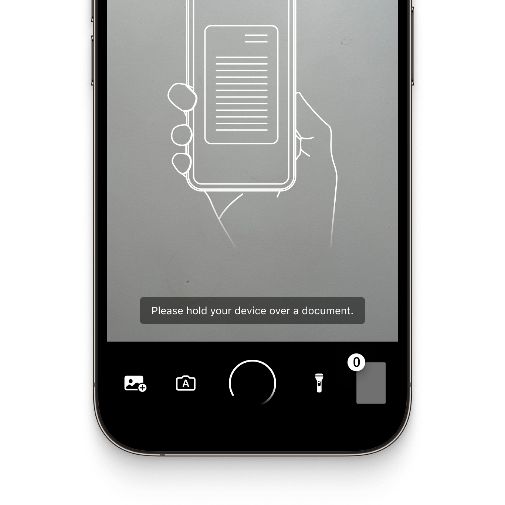
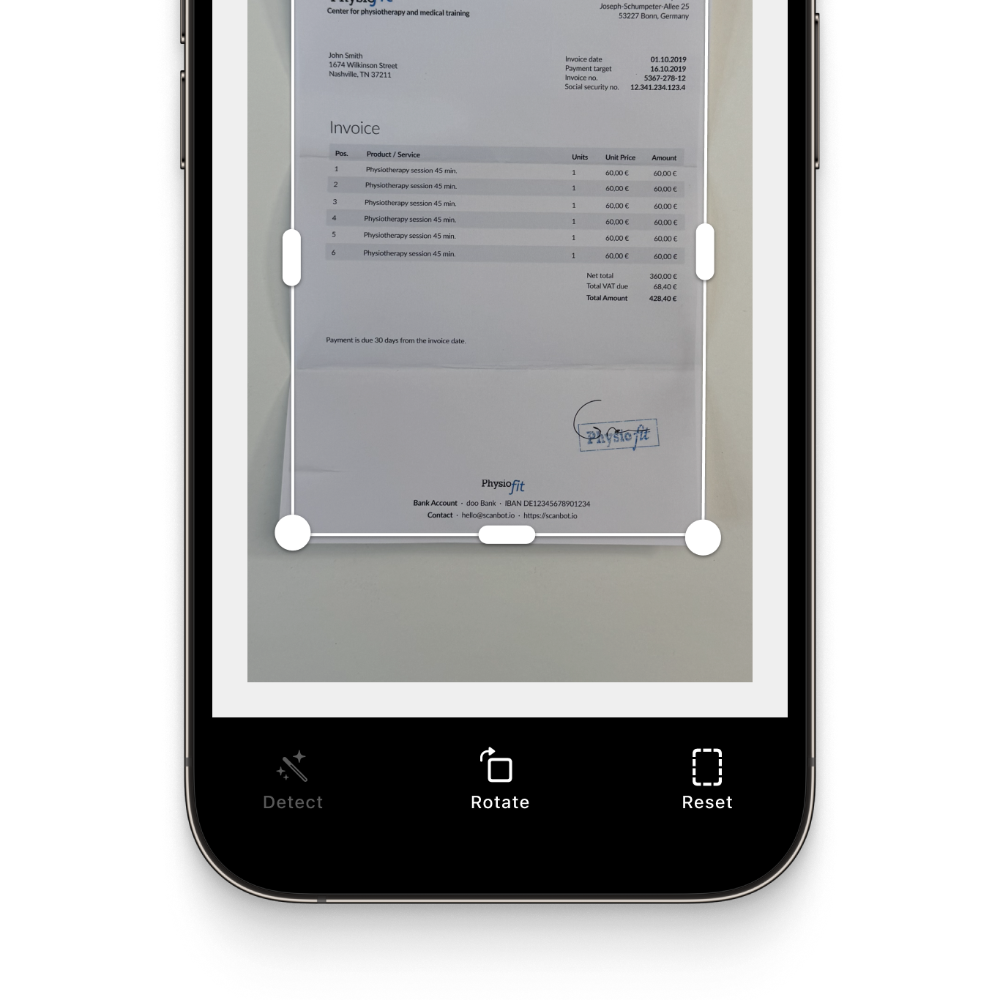
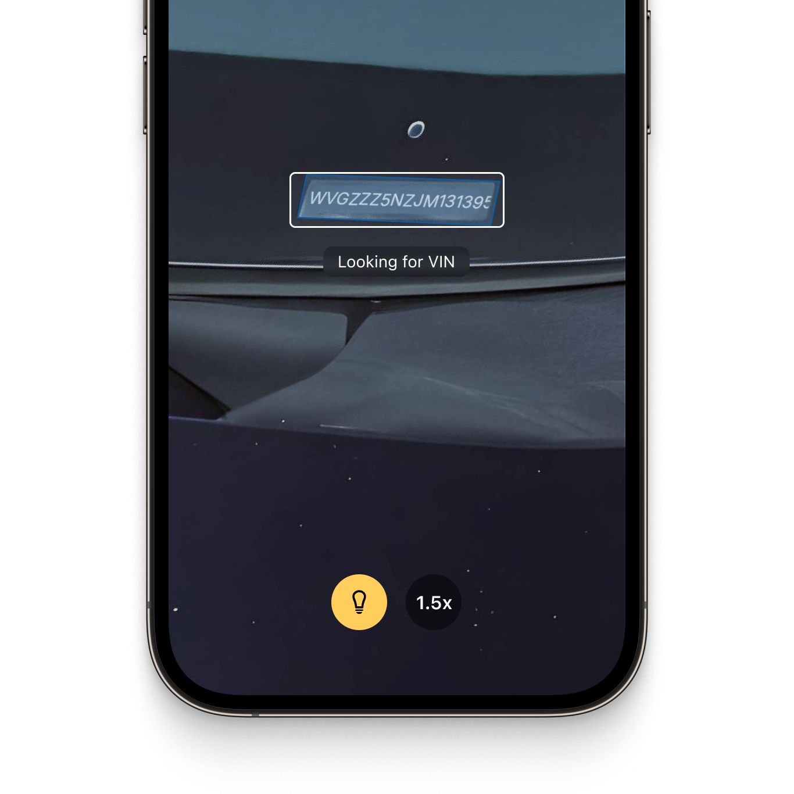

  

  

# Example app for the Scanbot Xamarin Document Scanner SDK and Data Capture Modules

This example app shows how to integrate the [Scanbot Document Scanner SDK](https://scanbot.io/document-scanner-sdk/?utm_source=github.com&utm_medium=referral&utm_campaign=dev_sites) and [Scanbot Data Capture Modules](https://scanbot.io/data-capture-software/?utm_source=github.com&utm_medium=referral&utm_campaign=dev_sites) for Xamarin.

## What is the Scanbot SDK?

The Scanbot SDK is a set of high-level APIs that lets you integrate document scanning and data extraction into your mobile apps and websites. It runs on all common mobile devices and operates entirely offline. No data is transmitted to our or third-party servers. 

With our Ready-To-Use UI (RTU UI) components, you can integrate the Scanbot SDK into your Xamarin app in less than an hour. 

💡 For more details about the Scanbot Xamarin Document Scanner SDK and Data Capture Modules, please check out our [documentation.](https://docs.scanbot.io/document-scanner-sdk/xamarin/introduction/?utm_source=github.com&utm_medium=referral&utm_campaign=dev_sites)

## Requirements

### Dev Tools
* Latest version of [Microsoft Visual Studio](https://visualstudio.microsoft.com/xamarin/) with Xamarin Platform.
* For iOS development: macOS with latest Xcode and Command Line Tools
  * **Note**: As Visual Studio for Mac is out-of-date. The last supported/tested Xcode was Xcode 15.3
* For Android development: Android SDK

### Mobile Platforms
* Android 5.0 (API Level 21) and higher
* iOS 13 and higher

### Mobile Devices
* Rear-facing camera with autofocus
* Supported CPUs and Architectures:
* Android: `armeabi-v7`, `arm64-v8a`, `x86`, `x86_64`
* iOS: `arm64`, `x86_64`

## Overview of the Scanbot SDK

### Document Scanner SDK

The Scanbot Xamarin Document Scanner SDK offers the following features:

* **User guidance**: Ease of use is crucial for large user bases. Our on-screen user guidance helps even non-tech-savvy users create perfect scans.

* **Automatic capture**: The SDK automatically captures the scan when the device is optimally positioned over the document. This reduces the risk of blurry or incomplete document scans compared to manually-triggered capture.

* **Automatic cropping**: Our SDK automatically straightens and crops the scans, ensuring high-quality document scans at all times.

* **Custom filters:** Every use case has specific image requirements. With the SDK’s custom image filters you can turn the generated final images into optimal input for your backend system. They include several color grayscale, several binarization options, and more.

* **Document Quality Analyzer:** This feature automatically rates the quality of the scanned pages from “very poor” to “excellent.” If the quality is below a specified threshold, the SDK prompts the user to rescan.

* **Export formats:** The Scanbot Document Scanner SDK supports several output formats (JPG, PDF, TIFF, and PNG). This ensures your downstream solutions receive the best format to store, print, or share the digitized document – or to process it further.

|  |  |  |
| :-- | :-- | :-- |

### Data Capture Modules

The Scanbot SDK Data Capture Modules allow you to extract data from a wide range of structured documents and to integrate OCR text recognition capabilities. They include:

#### [MRZ Scanner](https://scanbot.io/data-capture-software/mrz-scanner/?utm_source=github.com&utm_medium=referral&utm_campaign=dev_sites) 
This module allows quick and accurate data extraction from the machine-readable zones on identity documents. It captures all important MRZ data from IDs and passports and returns it in the form of simple key-value pairs. This is much simpler, faster, and less mistake-prone than manual data entry.

#### [Check Scanner (MICR)](https://scanbot.io/data-capture-software/check-scanner/?utm_source=github.com&utm_medium=referral&utm_campaign=dev_sites)
The MICR Scanner offers reliable data extraction from international paper checks, capturing check numbers, routing numbers, and account numbers from MICR codes. This simplifies workflows and reduces errors that frustrate customers and employees.

#### [Text Pattern Scanner](https://scanbot.io/data-capture-software/data-scanner/?utm_source=github.com&utm_medium=referral&utm_campaign=dev_sites)
Our Text Pattern Scanner allows quick and accurate extraction of single-line data. It captures information based on customizable patterns tailored to your specific use case. This replaces error-prone manual data entry with automatic capture.

#### [VIN Scanner](https://scanbot.io/data-capture-software/vin-scanner/?utm_source=github.com&utm_medium=referral&utm_campaign=dev_sites)
The VIN scanner enables instant capture of vehicle identification numbers (VINs) from trucks or car doors. It uses OCR to convert the image of the VIN code into structured data for backend processing. This module integrates into mobile or web-based fleet management applications, enabling you to replace error-prone manual entry with fast, reliable data extraction.

|  |  |  |
| :-- | :-- | :-- |

## Additional information

### Free integration support

Need help integrating or testing our Document Scanner SDK? We offer [free developer support](https://docs.scanbot.io/support/?utm_source=github.com&utm_medium=referral&utm_campaign=dev_sites) via Slack, MS Teams, or email.

As a customer, you also get access to a dedicated support Slack or Microsoft Teams channel to talk directly to your Customer Success Manager and our engineers.

### Trial license 

The Scanbot SDK examples will run for one minute per session without a license. After that, all functionalities and UI components will stop working.

To try the Scanbot Xamarin SDK without the one-minute limit, you can request a free, no-strings-attached [7-day](https://scanbot.io/trial/?utm_source=github.com&utm_medium=referral&utm_campaign=dev_sites) demo license key for your Xamarin project.

You can also try our demo application for the Scanbot Document Scanner SDKs [here.](https://scanbot.io/demo-apps/?utm_source=github.com&utm_medium=referral&utm_campaign=dev_sites)

### Pricing

Our pricing model is simple: Unlimited document scanning for a flat annual license fee, full support included. There are no tiers, usage charges, or extra fees. [Contact](https://scanbot.io/contact-sales/?utm_source=github.com&utm_medium=referral&utm_campaign=dev_sites) our team to receive your quote.

### Other supported platforms

Besides Xamarin and Xamarin Forms, the Scanbot Document Scanner SDK is also available on:

* [Android](https://github.com/doo/scanbot-sdk-example-android) (native)
* [iOS](https://github.com/doo/scanbot-sdk-example-ios) (native)
* [Flutter](https://github.com/doo/scanbot-sdk-example-flutter)
* [Capacitor & Ionic (Angular)](https://github.com/doo/scanbot-sdk-example-capacitor-ionic)
* [Capacitor & Ionic (React)](https://github.com/doo/scanbot-sdk-example-ionic-react)
* [Capacitor & Ionic (Vue.js)](https://github.com/doo/scanbot-sdk-example-ionic-vuejs)
* [Cordova & Ionic](https://github.com/doo/scanbot-sdk-example-ionic) 
* [.NET MAUI](https://github.com/doo/scanbot-sdk-maui-example)
* [JavaScript](https://github.com/doo/scanbot-sdk-example-web)
* [React Native](https://github.com/doo/scanbot-sdk-example-react-native)
* [Xamarin.Forms](https://github.com/doo/scanbot-sdk-example-xamarin-forms)

Our Barcode Scanner SDK additionally also supports [Compose Multiplatform / KMP](https://github.com/doo/scanbot-barcode-scanner-sdk-example-kmp), [UWP](https://github.com/doo/scanbot-barcode-scanner-sdk-example-windows) (Windows), and [Linux](https://github.com/doo/scanbot-sdk-example-linux).
